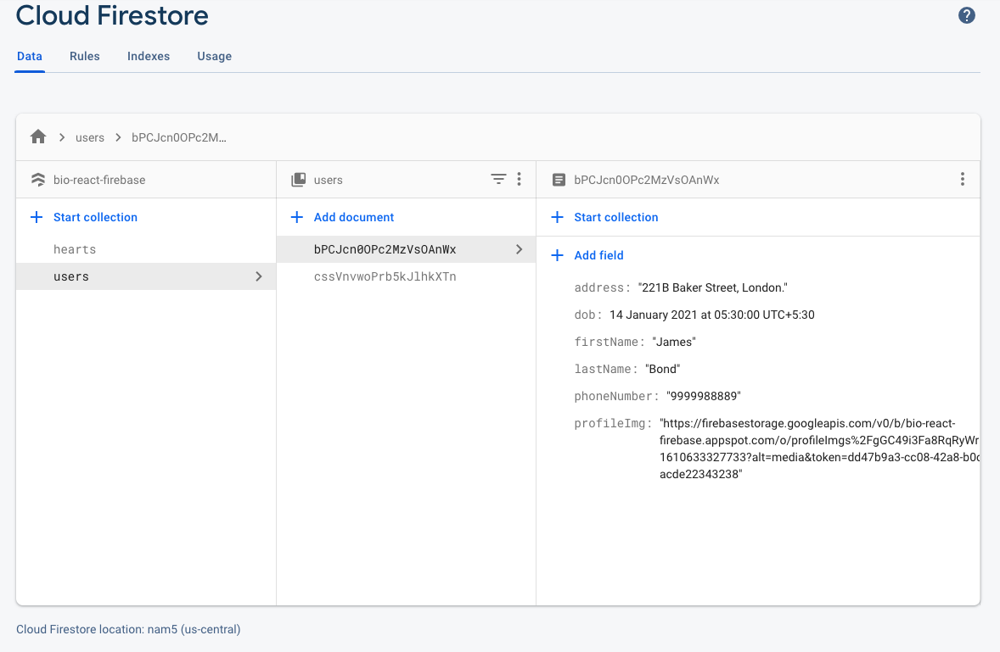
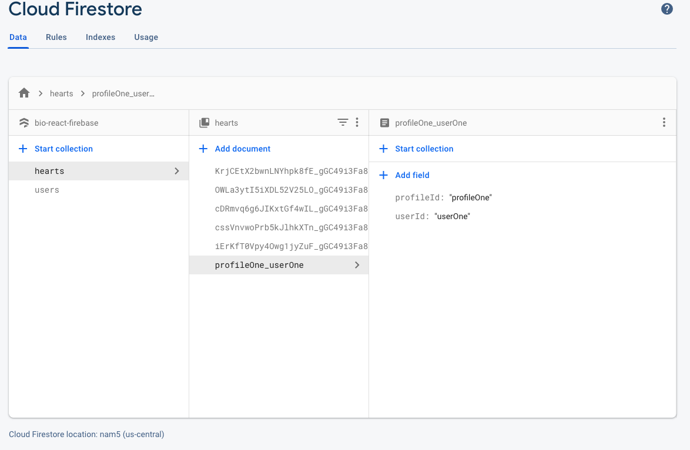
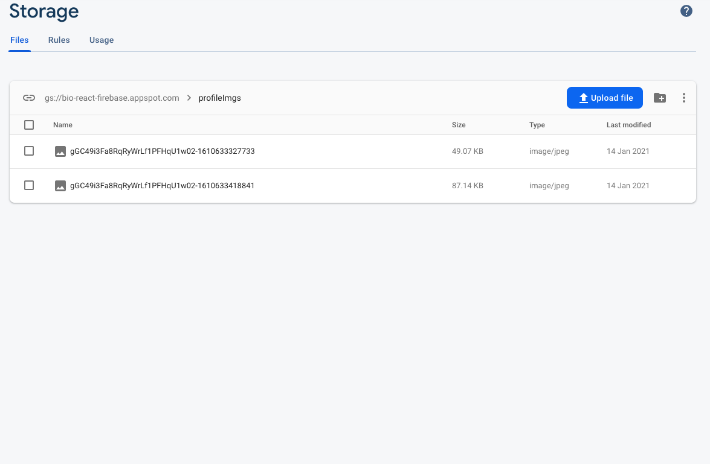
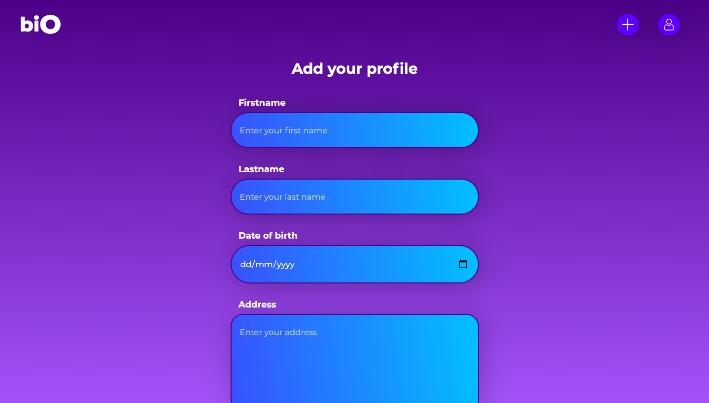
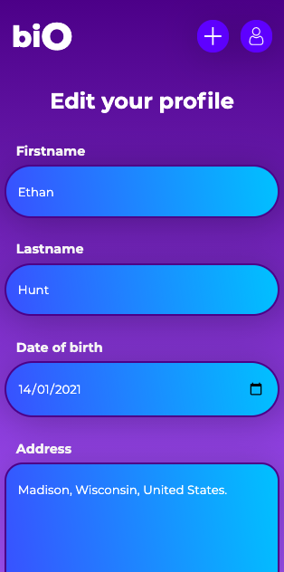
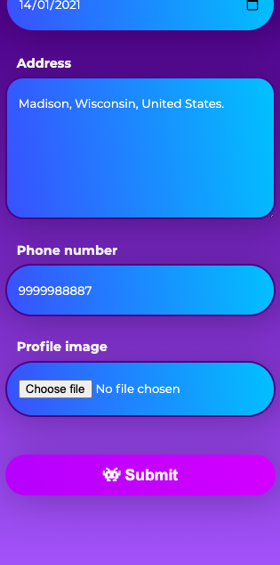

# biO

- There is one cloud function which aggregates the number of users hearted a profile
- CRUD functionalities using firestore
- Google Auth
- Firebase Storage
- Protected routes using react-router-dom

## Firestore and Storage shape

## Output

